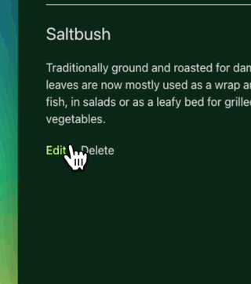

# Server Communication Examples

This is a collection of examples for communicating with a backend server.
Each frontend is basic Vite React website which can create, read, update, and delete information on the server backend.

## Example list

- GraphQL ✅
- tRPC ✅
- REST ✅
- WebSockets (soon)
- gRPC (soon)
- MQTT (soon)

## Aims

1. Compare different approaches for client to server communication
2. Show how TypeScript types are shared from the server to the client
3. Show how [Zod](https://github.com/colinhacks/zod) improves validation of server request data
